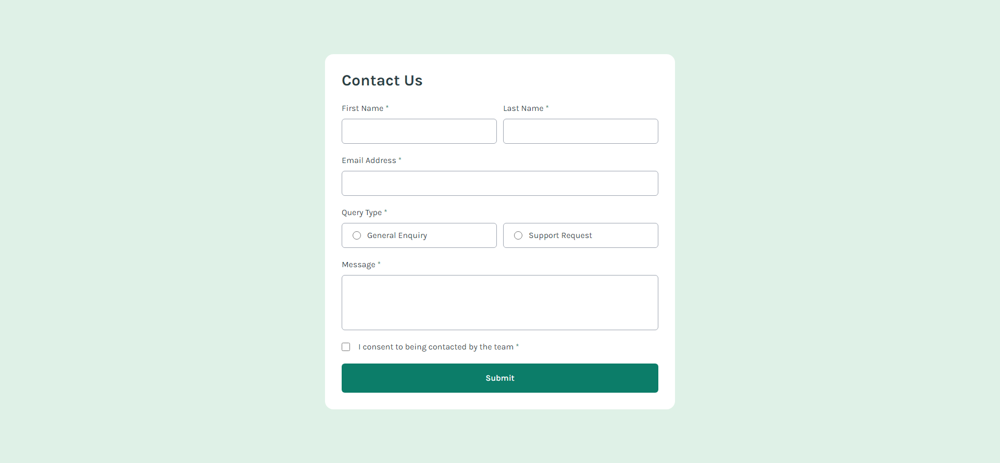

# Frontend Mentor - Contact form solution

This is a solution to the [Contact form challenge on Frontend Mentor](https://www.frontendmentor.io/challenges/contact-form--G-hYlqKJj). Frontend Mentor challenges help you improve your coding skills by building realistic projects. 

## Table of contents

- [Overview](#overview)
  - [The challenge](#the-challenge)
  - [Screenshot](#screenshot)
  - [Links](#links)
- [My process](#my-process)
  - [Built with](#built-with)
  - [What I learned](#what-i-learned)
  - [Continued development](#continued-development)
  - [Useful resources](#useful-resources)
- [Author](#author)

## Overview

### The challenge

Users should be able to:

- Complete the form and see a success toast message upon successful submission
- Receive form validation messages if:
  - A required field has been missed
  - The email address is not formatted correctly
- Complete the form only using their keyboard
- Have inputs, error messages, and the success message announced on their screen reader
- View the optimal layout for the interface depending on their device's screen size
- See hover and focus states for all interactive elements on the page

### Screenshot



### Links

- Solution URL: [lucarl07/contact-form](https://github.com/lucarl07/contact-form)
- Live Site URL: [Contact Form](https://contact-form-gold-phi.vercel.app)

## My process

### Built with

- TypeScript
- Flex containers
- Semantic HTML5 markup
- [Vite](https://vite.dev) - Build tool for web apps
- [ESLint](https://eslint.org) - JS linter
- [React](https://reactjs.org) - JS library
- [Tailwind CSS](https://tailwindcss.com) - CSS framework
- PostCSS & Autoprefixer, only in this project for the adequate integration of Tailwind CSS.

### What I learned

For starters, I wanted to do a relatively simple challenge coding-wise, focusing my energy on learning how to use 2 technologies which i'm relatively new at: TypeScript, JavaScript's strong-typed extension; and Tailwind CSS, a CSS framework centered around utility classes. Since my only significant experience with TypeScript was on the back-end, and Bootstrap's scarce utility options that occasionally made me resort to vanilla CSS, I was eager and determined to simultaneously apply both on a React application context. 

I can definitely say using Tailwind was like a walk in the park, at the very least. I really respect preprocessors like Sass (the only one i've used) for making stylesheet-writing easier through very neat features, and Bootstrap really helped me out on fast component stylization during exams, but no one of them matched the liberty **with** conciseness of Tailwind. For the first time ever, this is all of the explicit CSS I needed to write:

```css
@tailwind base;
@tailwind components;
@tailwind utilities;

@font-face {
  font-family: "Karla";
  src: url(fonts/Karla-VariableFont_wght.ttf);
}

:root {
  background-color: #dff1e7;
}

* {
  margin: 0;
  padding: 0;
  box-sizing: border-box;
  font-family: 'Karla', Arial, Helvetica, sans-serif;
  color: #2b4246
}
```

Everything nice and neat, without any component.style.css files in the case I wanted to use any slightly more niche property. Custom colors? Just add them to the [configuration file](./tailwind.config.ts). Animations with keyframes? Same answer, config file. Want to use a one-off value that does not exist on the framework natively? Dang it, just put it inside brackets! I've used all of those features, and, additionally, implemented viewport breakpoints and different styles according to element states.

```tsx
export default function Button({ children, ...rest }: ButtonProps) {
  return (
    <button {...rest} className="
      p-4 w-full rounded-md bg-lc-green-600 font-medium text-white 
      transition-colors active:bg-lc-grey-900
      md:hover:bg-lc-grey-900
    ">
      {children}
    </button>
  )
}
```

On the other hand, my experience with TypeScript was very valuable, but a tad bit more troublesome. For instance, when making custom hooks, I could not (and still can't) figure out why I couldn't return the array-spread values inside a new array, as you can see in [useFade.ts](./src/hooks/useFade.ts), where my solution was to return them as object properties:

```tsx
export default function useFade(initial: boolean) {
  const [show, setShow] = useState(initial);
  const [isVisible, setVisible] = useState(show);

  /* 9 lines... */

  return {isVisible, setVisible: setShow, fadeProps};
}
```

Besides that, the hardships that came with strong typing were not significant, I just had to learn parameter types on event handler functions (luckily for me I have built-in TS IntelliSense, thanks VSCode) and finding the best way to typeset component interfaces (ex.: are the input's error messages going to be nullable or not?), including extending default HTML element props into them.

One of the true hassles I faced was making the success state pop-up show and fade out after a successful submission. Because of this, I learned how to make delayed functions with Promises instead of the risky setInterval, and that also made me find a way to add a fading animation to React components. 

### Continued development

I will continue working with TypeScript & Tailwind CSS alongside React (spoiler: looking forward to Next.js!) as these tools have been proven very safe to implement, efficient and (more on Tailwind) time-saving. My next step will be building landing pages to focus a bit on the UI/UX aspect, hopefully using grid views. Hopefully, i'll be able to make a nice portfolio soon.

### Useful resources

- [Simple React fade animation hook](https://dev.to/ekeijl/simple-react-fade-animation-hook-5dp8) - This article has the most functional way i could find to add a fade animation to React components when an action is triggered.
- [Form Validation using React](https://www.youtube.com/watch?v=EYpdEYK25Dc&t=774s) - This is a very nice step-by-step guide to doing form validation, a skill that although i already knew, i never thought of handling field changes the way he showed.

## Author

- Website - Soon... 👀
- GitHub - [lucarl07](https://github.com/lucarl07)
- Frontend Mentor - [@lucarl07](https://www.frontendmentor.io/profile/lucarl07)
- LinkedIn - [Luiz Carlos Jr.](https://www.linkedin.com/in/lucarl07/)
